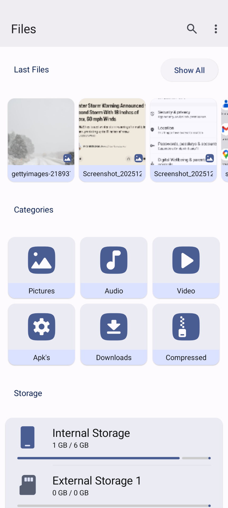
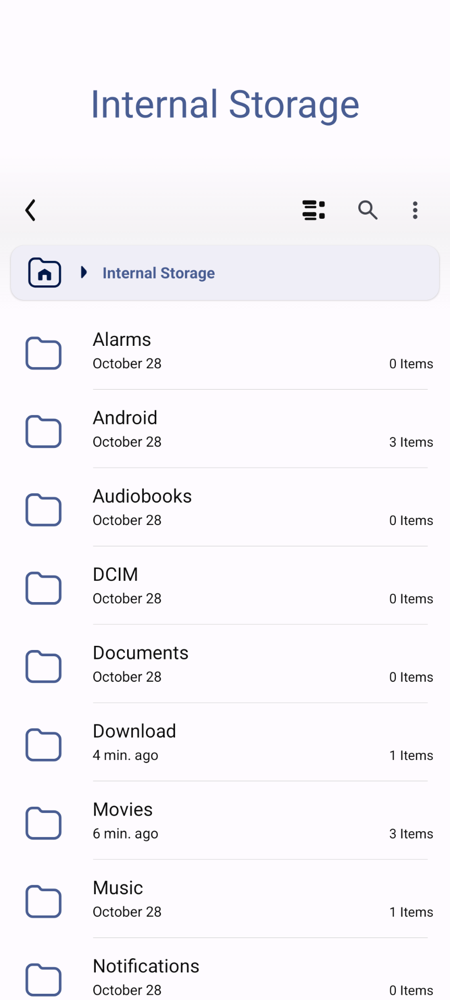
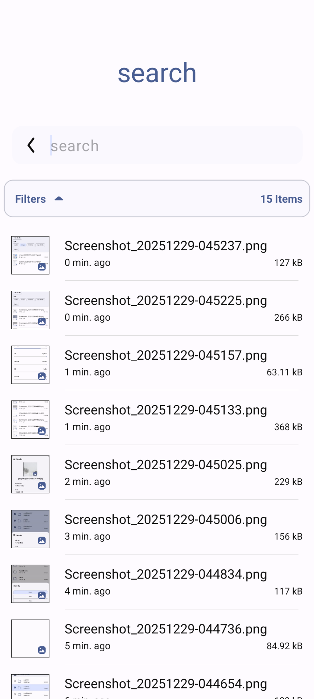
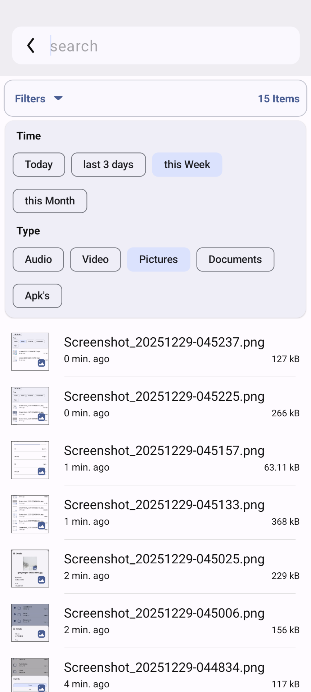
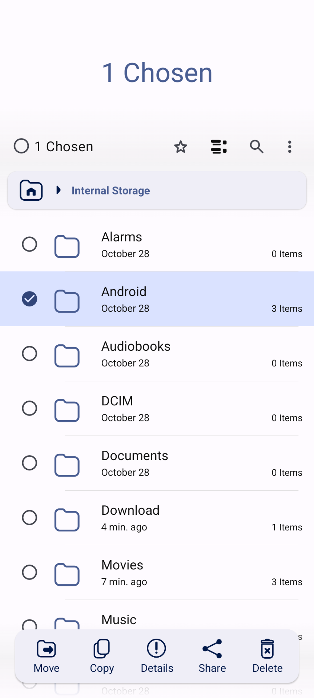
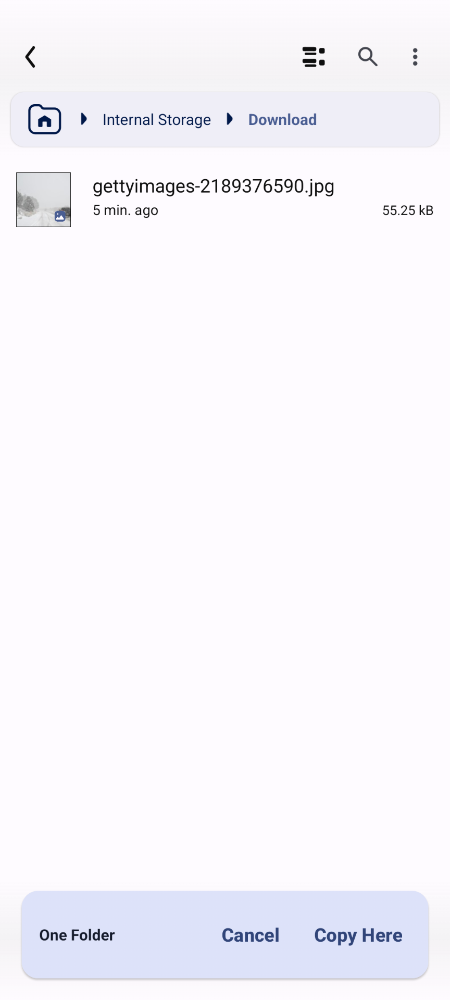
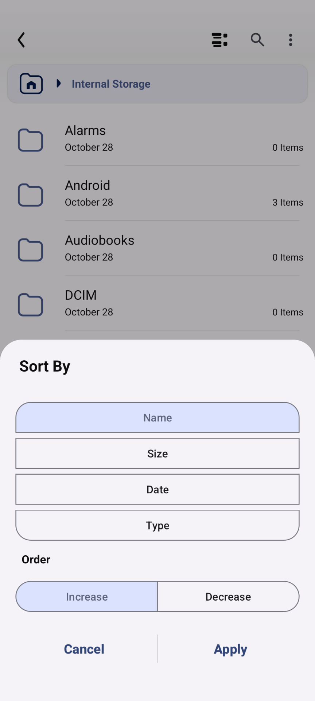
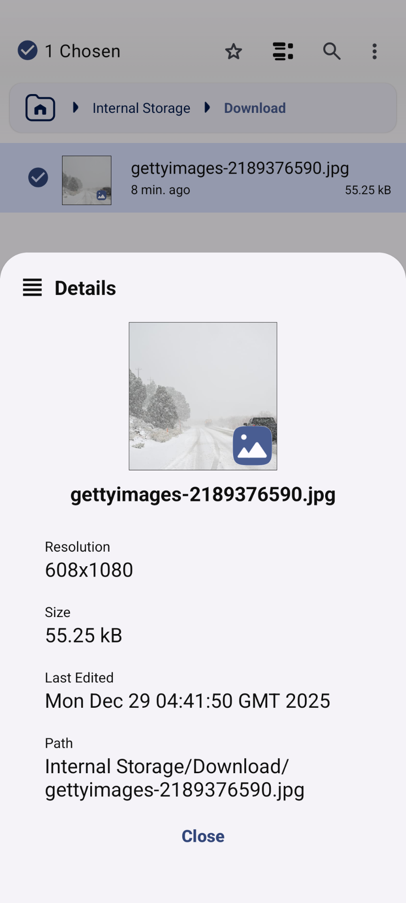
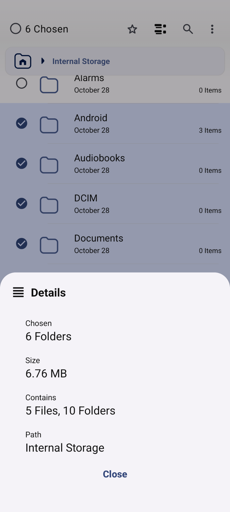

# Files - Android File Manager 📁

[](https://developer.android.com)
[](https://android-arsenal.com/api?level=24)
[](LICENSE)

A powerful, intuitive, and feature-rich file manager for Android. **Files** provides a clean user interface to manage your storage efficiently, featuring built-in tools like a Storage Analyzer and Audio Player.

---

## 🚀 Key Features

### 📂 Efficient File Management
*   **Standard Operations**: Copy, move, delete, rename, and share files/folders with ease.
*   **Storage Support**: Full access to Internal Storage and External SD Cards.
*   **Archive Viewer**: Seamless support for viewing and extracting formats: `ZIP`, `RAR`, `7Z`, `TAR`, `GZIP`, and more.
*   **Smart Search**: Robust search engine with advanced filters (Today, This Week, This Month).
*   **Custom Sorting**: Organize by Name, Size, Date, or Type (Ascending/Descending).

### 🛠️ Advanced Tools
*   **📊 Storage Analyzer**: Visualize storage distribution and identify large files.
*   **🏷️ Smart Categories**: Quick access to Pictures, Videos, Audio, Documents, Downloads, and APKs.
*   **🎵 Audio Player**: Built-in media player for a seamless experience.
*   **⭐ Favorites**: Bookmark frequent directories for instant access.
*   **🕒 Recent Files**: Keep track of your latest activities.

### 🎨 UI & Customization
*   **Adaptive Design**: Optimized for both Phones and Tablets.
*   **Dark Mode**: Full support for system-wide dark themes.
*   **Privacy**: Toggle visibility of hidden system files.
*   **Flexible View**: Toggle between Row View to Grid View.

---

## 📸 Screenshots

| Main Screen | File Explorer | Search Screen |
|:---:|:---:|:-----------------------------------------------------:|
|  |  |  |

|             Search Filters              | File Actions | Copy Navigation |
|:---------------------------------------:|:---:|:---:|
|  |  |  |

| Sort Options | File Details | Multiple-Details |
|:---:|:--------------------------------------------------------------:|:---:|
|  |  |  |

---

## 🛠 Tech Stack & Requirements
*   **Minimum SDK**: 24 (Android 7.0)
*   **Target SDK**: 36 (Android 15)
*   **Language**: Java / Kotlin
*   **Key Libraries**:
    *   [Material Components](https://github.com/material-components/material-components-android) - UI/UX
    *   [Glide](https://github.com/bumptech/glide) - Image loading
    *   [OkHttp](https://github.com/square/okhttp) - Networking (Self-updates)
    *   [Gson](https://github.com/google/gson) - JSON parsing (Self-updates)
    *   [ButterKnife](https://github.com/JakeWharton/butterknife) - View binding

---

## 🔒 Permissions
This app requires the following permissions to function correctly:
*   `MANAGE_EXTERNAL_STORAGE`: Required for file operations on Android 11+.
*   `REQUEST_INSTALL_PACKAGES`: To allow APK installations.
*   `POST_NOTIFICATIONS`: For background operation progress.

---

## 🏗 Installation & Build
1.  Clone the repository:
    ```bash
    git clone https://github.com/jacobel640/Files.git
    ```
2.  Open the project in **Android Studio**.
3.  Sync Gradle and run the `:app` module.

---

## 🤝 Contributing
Contributions are welcome! Feel free to open an Issue or submit a Pull Request.

---

## 👤 Author
**Jacob Elcharar**
*   GitHub: [@jacobel640](https://github.com/jacobel640)

---

## 📄 License
This project is licensed under the MIT License - see the [LICENSE](LICENSE) file for details.
